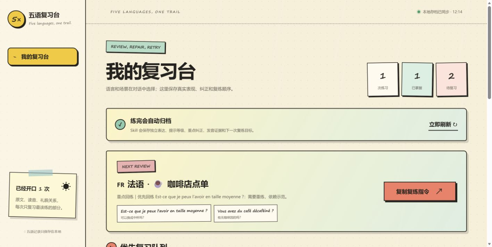
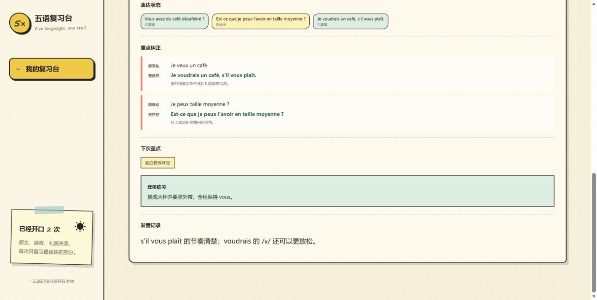

# 多语种口语练习（Multilingual Speaking）

一个面向 Codex 的 A1 多语种口语陪练 Skill，支持西班牙语、法语、德语、日语和韩语。语言与主题在对话中确定，随后生成预习卡并进入短回合角色扮演；练习结束后会自动整理真实表现、纠正和下一步，并归档到本地复习台。

这是独立于 [`kouyu`](https://github.com/maverickgao8848/kouyu) 的多语言版本。英语练习请使用 `kouyu`，本仓库专注西、法、德、日、韩五种语言。



## 能做什么

- 支持西班牙语、法语、德语、日语、韩语五种语言，当前审定范围为 CEFR A1
- 每种语言提供 26 个实用主题：6 个已备课、可追溯来源的场景，以及 20 个明确标注为“需现场准备”的原创练习主题
- 覆盖咖啡店点单、问路与公共交通、看医生、自我介绍、购物、约时间等核心场景
- 提供 5、10、20、40 分钟四种练习节奏，以及沉浸式、引导式、学习式三种辅助模式
- 支持文字、语音和混合练习；没有真实音频证据时不会臆测发音问题
- 遵守不同语言的称谓、礼貌等级和文字展示习惯，日语默认不显示罗马字
- 区分独立表达、提示后表达和未使用目标，并按实际证据生成复盘建议
- 将记录保存为本地 JSON / Markdown，并提供多语言复习台和下一课推荐

## 安装

需要 **Python 3.10+**（仅标准库，无需 pip / Node.js / API Key）、Git，以及能加载本地 Skill 并执行脚本的 Codex 客户端。

macOS / Linux：

```bash
git clone https://github.com/maverickgao8848/multilingual-speaking.git ~/.codex/skills/multilingual-speaking
```

Windows PowerShell：

```powershell
git clone https://github.com/maverickgao8848/multilingual-speaking.git "$env:USERPROFILE/.codex/skills/multilingual-speaking"
```

重新打开 Codex 后即可使用。已经安装时，请在安装目录运行 `git pull --ff-only` 更新，不要重复克隆。

## 开始练习

直接说：

```text
使用 $multilingual-speaking 帮我做一次 10 分钟的日语口语训练。
程度：A1
中文辅助：引导式
先让我看完整主题菜单。
```

如果没有指定主题，Skill 会先显示该语言全部 26 个主题，并明确标出：

- `已备课`：已经内置来源与目标表达，可以直接生成预习卡
- `需现场准备`：当次原创准备，不会冒充预置课程或教材内容

选择主题后会先出现预习卡；你明确表示准备好后才进入角色扮演。任何自然的“结束并复盘”表达都会立即退出角色并生成报告。

## 课程查询

以下命令均在仓库根目录（包含 `SKILL.md` 的目录）执行。

查看日语的完整主题菜单：

```bash
python scripts/materials.py topics --language ja --format markdown
```

生成一张 20 分钟的日语问路预习卡：

```bash
python scripts/materials.py card --language ja --scene directions --duration 20
```

语言代码为 `es`、`fr`、`de`、`ja`、`ko`。运行时只读取仓库内的 `curriculum/`，不会依赖外部课程目录。

## 本地复习台

启动复习台：

```bash
python scripts/workbench.py serve
```

Windows 安装后可从任意目录启动，并固定使用同一份数据：

```powershell
python "$env:USERPROFILE/.codex/skills/multilingual-speaking/scripts/workbench.py" serve
```

终端会显示本地访问地址。保持终端运行，按 `Ctrl+C` 停止。复习台不会再次要求选择语言或主题；它会按语言和场景展示真实表现、自然改法、提示依赖、发音证据和下次复练建议，并定时刷新。

默认数据目录固定为用户主目录下的 `multilingual-speaking-workbench`，因此无论从哪个文件夹启动，归档与网页都会读取同一份历史。只有想更换存放位置时，才需要给 `archive` 和 `serve` 同时传入相同的 `--data-dir`。



归档一次训练：

```bash
python scripts/workbench.py archive --input path/to/session.json
```

Session 格式和证据规则见 [复习台数据规范](references/workbench-data.md)。正常练习结束时 Skill 会根据本次对话直接执行归档，不需要学习者手工维护 JSON。

## 项目结构

```text
.
├── SKILL.md                    # Skill 入口、路由与互动规则
├── agents/openai.yaml          # 显示名称、简介与默认提示词
├── curriculum/                 # 运行时必需的内置课程、主题与来源数据
├── references/                 # 语言、备课、会话和复习数据规范
├── scripts/materials.py        # 主题菜单与预习卡查询
├── scripts/workbench.py        # 本地归档、推荐与网页服务
├── assets/workbench/           # 复习台前端
└── docs/screenshots/           # README 中展示的真实工作台截图
```

## 课程边界与隐私

本 Skill 会保留“已备课”和“当次原创准备”的边界，不会虚构教材出处，也不会把原创扩展伪装成已审定课程。来源与映射信息保存在 `curriculum/` 中，用户练习记录则只写入你指定的本地数据目录，不会上传到 GitHub。

提交公开仓库前，请确认不要加入个人 session JSON、复习台目录或其他学习记录。
